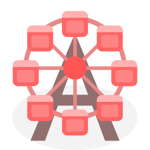

# Welcom to Playground by Andrash

Hello! I'm Andrash Yang, the author of this project.

I'm a full-stack developer with over 10 years of experience in software development, including game development and mobile app development.

What You are seeing now is the source code of my portfolio website - [Playground by Andrash](https://andrash.dev).

**I built this website as my portfolio** to showcase my skills and experience, hoping to find a job that I love.

This website is part of an ongoing project. I'll keep adding new features to it. I've released it to the public at this stage because it's already good enough to serve as a portfolio. However, I have more ambitious plans for it.

## The Tech Stack

This website is built using `React.js` for the frontend and `Node.js` for the backend. `Vite` serves as the bundler for the frontend, while `Express.js` and `socket.io` are used for API implementation and server-client communication. `Jest` is used for unit testing. `PM2` is used to manage the backend process.

The entire project is written in `TypeScript`, utilizing the `Object-Oriented Programming` (OOP) style.

All the game image assets are illustrated by me using `Inkscape` and animated by directly editing the `SVG` files.

## The Multiplayer Online Game Engine

The most unique thing about this website is that it's built on top of a customized `multiplayer online game engine` that I developed. This engine provides visitors with an unconventional, game-like web browsing experience. It allows visitors to share the same game world (playground) and interact with each other in real-time.

The game engine runs on both the frontend and the backend and is kept synced through a set of [dedicated APIs](frontend/public/pages/Server-Client_Communication_API.md) implemented with `socket.io`.

## About the Source Code

I am happy that you are here to check out my source code.

I certainly believe that one's code can speak for itself. By checking out my source code, you can get a sense of my coding style and software design skill.

- For server-side code, please check out the `app` [directory](app).
- For client-side & shared code, please check out the `frontend/src` [directory](frontend/src).
- For the game engine, please check out the `frontend/src/lib` [directory](frontend/src/lib).
- For React components & game rendering, please check out the `frontend/src/components` [directory](frontend/src/components).
- For web page layout, where the components are put together, please check out the `frontend/src/layouts` [directory](frontend/src/layouts).
- For static assets, please check out the `frontend/src/icons` [directory](frontend/src/icons).
- For dynamic assets, please check out the `frontend/public` [directory](frontend/public).
- For game assets, please check out the `frontend/public/assets` [directory](frontend/public/assets).
- For all the markdown documents & pages, please check out the `frontend/public/pages` [directory](frontend/public/pages).
- For jest unit tests, please check out the `frontend/tests` [directory](frontend/tests).

## Contact Me

If you find my work interesting and would like to hire me to work for your cool project, please feel free to contact me at [cocoychris@gmail.com](mailto:cocoychris@gmail.com).

To learn more about me, please visit my portfolio website at [https://andrash.dev](https://andrash.dev).
